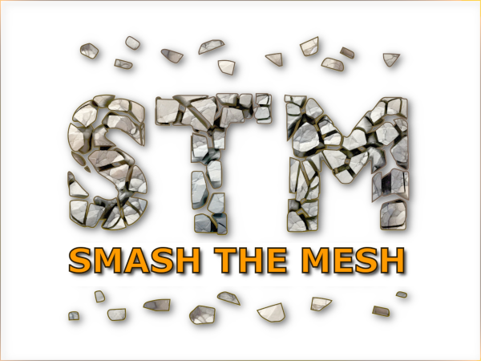
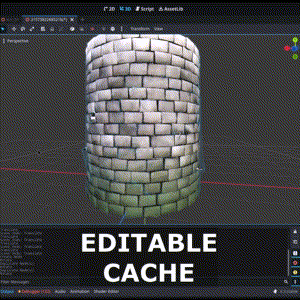
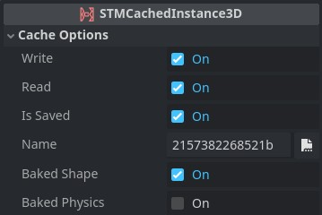
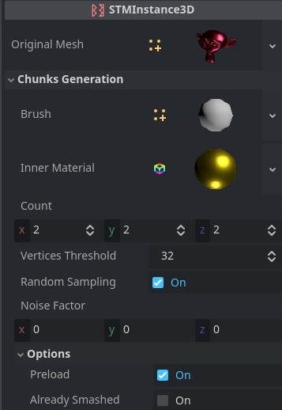
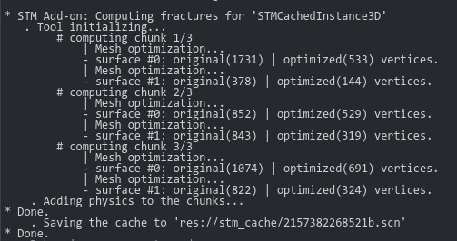

 

## Introduction

**Smash The Mesh (STM)** is a Godot add-on that allows you to **break a 3D mesh** into **multiple pieces** and then **apply physics** to each fragment. It also offers the ability to **save the results to disk (cache)** and load them quickly, thereby avoiding the need for repetitive, often time-consuming computations.

<p align="center"> 
     
     
     
</p>

#### *Note*: This is a *BETA* version and is still under development. It should be tested thoroughly to assess its suitability for your needs.

### Under the Hood

STM uses Godot's **Constructive Solid Geometry (CSG)** system to create fragments from a mesh.

<br>

## Table of Contents
- [STM Nodes](#stm-nodes)
- [Installation](#installation)
- [Getting Started Example](#getting-started-example)
- [API Documentation](#api-documentation)
- [Cache System Documentation](#cache-system-documentation)
- [Chunks Generation Documentation](#chunks-generation-documentation)
- [Physics Settings Documentation](#physics-settings-documentation)
- [Performance Tips](#performance-tips)
- [Known Issues](#known-issues)
- [Additional Resources](#additional-resources)
- [Contribution](#contribution)
- [License](#license)

<br>

## STM Nodes

- <h3>  STMInstance3D</h3>

  This class is ideal for handling lightweight geometry (with few chunks) that doesn't require intensive computation. It can automatically break a mesh and apply physics to the resulting chunks. This can be done either at loading time (with `chunk_opt_preload = true`) or when the `smash_the_mesh()` method is called. For performance-critical scenarios, it is highly recommended to use `STMCachedInstance3D`.

- <h3>  STMCachedInstance3D</h3>

  This class extends `STMInstance3D` by adding a caching system that only recomputes data when it becomes invalid (for example, if you change the generation parameters). The cache is stored as a compressed scene on the disk, with the default path set to `res://stm_cache/`. This cache can be reused across multiple instances with the same geometry. However, be cautious when dealing with a lot of geometry and many fragments, as the size of the cache file will increase. It’s a good idea to periodically check the folder.

  To open a cache file, simply double-click on it. You can inspect the result and even make edits as needed, but it's important to maintain the tree structure. Note that manually modifying a cache file will invalidate it, so be sure to set `cache_write = false` to ensure your changes are not overwritten the next time the program runs.

<br>

## Installation

1. Download the [repository](https://github.com/cloudofoz/godot-smashthemesh/archive/refs/heads/main.zip).

2. Import the **addons** folder into your project.

3. Activate `Smash The Mesh` under *Project > Project Settings > Plugins.*

## Getting Started Example

1. Add a *STMCachedInstance3D* node to the scene.

2. Add a new `TorusMesh` in the `Original Mesh` field.

3. Add at least a `Camera3D` node in the scene and make it look the torus.
   
4. Write this code in a `script`:
   
```gdscript
# Break the mesh when you press the SPACE key
func _input(event: InputEvent) -> void:
    # Check if the event is a key press
    var key_event = event as InputEventKey
    
    # Reference to the STM instance (ensure this matches the name in your scene tree)
    var stm_instance = $STMCachedInstance3D
    
    # Return if STM instance or key event is invalid, or the key is not SPACE
    if !stm_instance or !key_event or key_event.keycode != KEY_SPACE:
        return
    
    # Break the mesh when SPACE is pressed
    if key_event.is_pressed():
        stm_instance.smash_the_mesh()
    
    # Apply an "explode" impulse to each fragment/chunk when SPACE is released
    elif key_event.is_released():

        # Define a callback to apply an impulse to a rigid body chunk
        var explode_callback = func(rb: RigidBody3D, _from):
            rb.apply_impulse(-rb.global_position.normalized() * Vector3(1, -1, 1) * 5.0)
        
        # Apply the callback to each chunk of the mesh
        stm_instance.chunks_iterate(explode_callback)
```

5. Run your program and hit the SPACE to make the torus explode.

<br>

## API Documentation

### `is_smashed() -> bool`
**Description:**  
Returns `true` if the current instance has been smashed, otherwise returns `false`.

### `smash_the_mesh()`
**Description:**  
Hides the mesh of the current instance and spawns the physical chunks in its place.  

- **Note (1)**: The chunks will not appear until this method is called.
- **Note (2)**: If you're applying physics (e.g., `apply_impulse()`) immediately after `smash_the_mesh()`, ensure that the `RigidBody3D` is fully initialized in the physics space. To avoid issues, consider awaiting a process frame or using `call_deferred()` to apply the physics after the current frame.

### `add_physics_to_self()`
**Description:**  
Automatically adds a `RigidBody3D` and a `CollisionShape3D` to the current instance, using the same physics settings as the chunks.

### `chunks_iterate(callback: Callable)`
**Description:**  
Iterates over all the chunks' `RigidBody3D` instances, allowing you to perform operations on the chunks of this instance.  
**Example of `callback`:**

```gdscript
# Perform an action for each chunk
callback := func(rb: RigidBody3D, from: DestructableMesh):
    # Get the collision shape of each chunk
    var collision_shape = rb.get_child(0) as CollisionShape3D
    # Get the mesh instance of each chunk
    var mesh_instance = collision_shape.get_child(0) as MeshInstance3D
    # ...perform additional actions with each chunk (e.g., apply a force)
```

### `chunks_get_elapsed_time() -> float`
**Description:**  
Returns the time elapsed (in seconds) since `smash_the_mesh()` was called.  
Returns `0` if `smash_the_mesh()` has not been called.

### `chunks_restart_elapsed_time()`
**Description:**  
Updates the elapsed time as if `smash_the_mesh()` was just called.  
This is useful for restarting time-based animations without restoring the chunks to their original state.

### `chunks_kill()`
**Description:**  
Removes all the chunks of this mesh instance.

### `chunks_reset()`
**Description:**  
Resets this instance to its state before `smash_the_mesh()` was called.

### `chunks_freeze(enable: bool)`
**Description:**  
Freezes or unfreezes the physics simulation of the chunks.  
- `enable`: Pass `true` to freeze the simulation, or `false` to unfreeze it.

### `chunks_repair(weight: float)`
**Description:**  
Reverts the chunks to their starting position.  
- `weight`: The amount of repair, from `0` (no repair) to `1` (fully repaired).  
This method can be called each frame with a low value of `weight` to create a backward animation to the original position.  
**Tip:** Ensure that `chunks_freeze()` is called before using this method to avoid disrupting the physics simulation.

<br>

## Cache System Documentation

<p align="center"> 
     
</p>

### `@export var cache_write: bool = true`
**Description:**  
When enabled, the cache will be overwritten when the cached data becomes invalid.  
If multiple instances use the same cache file, it is advisable to have only one instance with `cache_write = true`. This allows you to modify the cache data for all instances from a single point (the instance with `cache_write = true`).

### `@export var cache_read: bool = true`
**Description:**  
When enabled, the object will attempt to load data from the cache file instead of computing it.  
- If the cache isn't found, the data will be computed (either at loading time or when needed).
- If `cache_write = true`, the computed data will be saved to disk, preventing future computations.
- If `cache_read = false`, the data will always be computed at run-time.

### `@export var cache_is_saved: bool = false`
**Description:**  
An informational property (not meant to be modified) that indicates whether this instance can read the cache from disk without the need to recompute the data.

### `@export_file("*.scn") var cache_name: String = str(get_instance_id())`
**Description:**  
Specifies the name of the cache file on disk.  
- To have multiple instances of the same object read from the same cache, set the same `cache_name` for all instances.
- In this case, it is advisable to disable `cache_write` for all instances except one, which can be used to modify the cache.
- To ensure that the cache data is never overwritten, set `cache_write = false` for all objects.

### `@export var cache_baked_shape: bool = true`
**Description:**  
When enabled, the collision shape of the chunks will be read directly from the cache without being recomputed.  
- If you want to keep the chunk data from the cache but use a different collision shape, set `cache_baked_shape = false`.

### `@export var cache_baked_physics: bool = false`
**Description:**  
When enabled, all physics data of the chunks will be read directly from the cache without being recomputed.  
- If you want to keep the chunk data from the cache but use different physics settings, set `cache_baked_physics = false`.

<br>

## Chunks Generation Documentation

<p align="center"> 
     
</p>

### `@export var original_mesh: Mesh`
**Description:**  
Specifies the original (source) mesh that you want to break into chunks.

### `@export var chunk_brush: Mesh = StandardBrush`
**Description:**  
Defines the mesh used as an intersection volume for each voxel to create the chunks.  
- The shape of the brush can significantly influence the result and may cause unwanted artifacts if not chosen carefully.
- If you create custom brush meshes, keep them centered on the origin of the system with a size close to `1x1x1` to avoid unpredictable results.
- A set of experimental brush meshes is available in the "brushes" sub-folder. For example, the "wood" brush has been used for simulating the breaking of wood material.

### `@export var chunk_inner_material: StandardMaterial3D`
**Description:**  
Specifies the material to be used for the inner parts of the chunks.

### `@export var chunk_count: Vector3i = Vector3i(2, 2, 2)`
**Description:**  
Represents the 3D voxel grid, which also indicates the maximum number of chunks that can be created for each axis.  
- The maximum number of chunks is determined by `chunk_count.x * chunk_count.y * chunk_count.z`.
- Example: If your object is tall (Y axis) but thin (X, Z), you might increase the count on the Y axis while keeping the other two values low to achieve the desired effect.

### `@export var chunk_vertices_threshold: int = 32`
**Description:**  
Sets the minimum number of vertices required for a chunk to be retained.  
- Choosing this value carefully is important to avoid creating insignificant chunks. 
- Note: Higher values can reduce the number of chunks created.
- **Tip:** Monitor the console when generating chunks to see the vertex count for each chunk, and adjust this value accordingly.

<p align="center"> 
     
</p>

### `@export var chunk_random_sampling: bool = true`
**Description:**  
When set to `false`, chunks are removed from the mesh starting from the minimum position of the bounding box.  
- Disable this flag if you need more regular and predictable chunking results.

### `@export var chunk_noise_factor: Vector3 = Vector3.ZERO`
**Description:**  
Specifies the amount of noise applied to the brush geometry before computations.  
- Adding noise can create interesting irregularities but may also cause artifacts.
- This factor is size-dependent. If you notice excessive artifacts, try setting the noise factor to `0`.

### `@export var chunk_opt_preload: bool = true`
**Description:**  
If `true`, chunk computation will occur at loading time.  
- When `false`, chunks will only be calculated when the `smash_the_mesh()` method is called.

### `@export var chunk_opt_already_smashed: bool = false`
**Description:**  
If `true`, the `smash_the_mesh()` method will be automatically called at the start.

<br>

## Physics Settings Documentation

<p align="center"> 
     
</p>

### `@export_enum(...) var phys_shape: int = 1`
**Description:**  
Specifies the collision shape to be used for each chunk.  
- **Options:**
  - `Sphere: 0`
  - `Box: 1`
  - `Capsule: 2`
  - `Cylinder: 3`
  - `ConvexShape: 4`
- **Note:** If precise collisions are required, you can use `ConvexShape`, but be aware that it may cause performance loss when dealing with a large number of chunks.

### `@export_range(0.01, 10, 0.1, "or_greater") var phys_total_mass: float = 1.0`
**Description:**  
Represents the mass of the entire geometry. Each chunk will have a fraction of this mass based on its volume or size.

### `@export var phys_material: PhysicsMaterial = null`
**Description:**  
Specifies the physical material to be applied to each chunk.

### `@export_flags_3d_physics var phys_collision_layer: int = 1`
**Description:**  
Defines the physics layers that the chunk will check for collisions.

### `@export_flags_3d_physics var phys_mask_layer: int = 1`
**Description:**  
Specifies the physics layers where the chunk will reside when another collider checks for collisions.

### `@export_range(0.0, 1.0, 0.05, "or_greater") var phys_collision_priority: float = 1.0`
**Description:**  
Represents how much a collider will be allowed to penetrate another object. This value helps determine the priority of collision handling.

<br>

## Performance Tips

- **Mesh Complexity**: High polygon meshes may result in slow fragmentation. Consider simplifying the mesh before fragmentation.
- **Caching**: Use the caching feature to save fragmented meshes and improve load times.
- **Physics Settings**: Adjust physics settings to balance realism and performance, especially for large numbers of fragments.

## Known Issues

- Some meshes may not fragment as expected due to limitations in the CSG system.
- Performance may degrade significantly with very complex meshes or large numbers of fragments.
- **Mesh Original Size Issue**: If you encounter problems fracturing the mesh, try checking the mesh's original size. Until this issue is fixed, there may be difficulties with meshes that are not at least 1 unit in size on at least one axis (preferably larger). For example, a long but thin panel may still work if at least one dimension is sufficiently large to avoid problems with the voxel grid used for fracture computation.
- As this is a BETA version, there may be other unforeseen issues. Please report any bugs to the issue tracker.

## Additional Resources

- **[Tutorial Video by AntzGames](https://youtu.be/qMXZnxzWs8s?feature=shared)**: A clear and simple video tutorial on how to use the **SmashTheMesh** plugin. Great for beginners looking for a straightforward introduction to the fundamentals.

## Contribution

Contributions are welcome! Please fork the repository and submit a pull request with your improvements. Make sure to follow the project's coding standards and write clear commit messages.

## License

[MIT License](/LICENSE.md)
